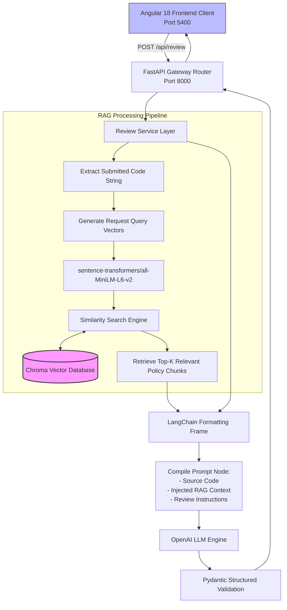
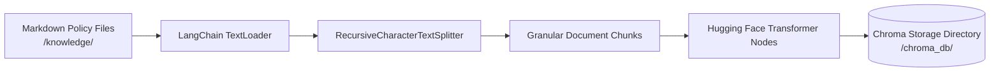

# 🔍 AI Code Reviewer (LangChain + Hybrid Local RAG)

An AI-powered automated code review application that combines **OpenAI**, **LangChain**, **Retrieval-Augmented Generation (RAG)**, local **Hugging Face embeddings**, and a **Chroma** database to audit submitted source code against both general engineering best practices and **organization-specific coding standards**.

The project features a high-performance **FastAPI** backend and an **Angular 18** frontend client.

---

## 💡 Why This Project Uses RAG

Standard Large Language Models can identify generic algorithmic problems like SQL injection out of the box. However, they lack access to internal business architectures and corporate structural mandates.

This project implements RAG to ground validation pipelines in **private organization guidelines that the model cannot know inherently**:

> 📝 **Example Organization Mandate:**
> "Application services and API controllers must not access the database directly. All database operations must be implemented through Repository classes." [1]

If submitted source code bypasses this pattern by invoking a raw `database.execute()` execution block, Chroma flags the specific corporate policy chunk, injecting it directly into the prompt context. The reviewer then surfaces two layers of feedback simultaneously:
1. **General Vulnerabilities**: e.g., raw string concatenation triggering SQL injection risks.
2. **Organization Violations**: e.g., bypassing the engineering team's Repository layer patterns.

---

## 🧠 System Architecture

The orchestration engine routes client submissions through local embedded vector comparisons before formatting an immutable, structured cognitive instruction block for the main model.



---

## 🧱 Data Ingestion & Runtime Query Flows

Data state management is split cleanly into a static **Ingestion Pipeline** and an execution-time **Query Extraction Engine**.

### 1. Vector Database Ingestion Pipeline


### 2. Runtime Review Query Extractor


---

## 🛠️ Technology Stack

| Layer | Technology | Functional Domain |
| :--- | :--- | :--- |
| **Frontend** | Angular 18 | Reactive submission layout & code-highlighting dashboards [1] |
| **API Server** | Python 3.11, FastAPI, Uvicorn | Asynchronous endpoint router & request parser [1] |
| **Cognitive Core** | OpenAI API | Multi-model reasoning & code evaluation engine [1] |
| **Orchestration** | LangChain Core & Community | Component piping, variable binding, & LLM execution tracing [1] |
| **Local Embeddings** | Hugging Face Transformers | Local high-speed text vector conversions [1] |
| **Embedding Model** | `sentence-transformers/all-MiniLM-L6-v2` | Dense 384-dimensional spatial mapping text models [1] |
| **Vector Database** | Chroma | Local file-persisted spatial array registry [1] |
| **Data Validation** | Pydantic v2 | Strict JSON schema assertion & structured object casting [1] |

---

## 📁 Project Structure

```text
ai-code-reviewer-rag/
│
├── backend/
│   ├── app/
│   │   ├── api/
│   │   │   ├── review_routes.py
│   │   │   └── retrieval_routes.py
│   │   ├── chains/
│   │   │   └── code_review_chain.py
│   │   ├── models/
│   │   │   ├── review_models.py
│   │   │   └── retrieval_models.py
│   │   ├── prompts/
│   │   │   └── review_prompt.py
│   │   ├── services/
│   │   │   ├── llm_service.py
│   │   │   ├── rag_service.py
│   │   │   └── review_service.py
│   │   └── main.py
│   │
│   ├── knowledge/
│   │   ├── clean-code/
│   │   │   └── clean_code.md
│   │   ├── organization/
│   │   │   └── database_standards.md
│   │   ├── python/
│   │   │   └── python_best_practices.md
│   │   └── security/
│   │       └── secure_coding.md
│   │
│   ├── scripts/
│   │   ├── ingest_knowledge.py
│   │   ├── test_rag_service.py
│   │   ├── test_retrieval.py
│   │   └── test_review_service.py
│   └── requirements.txt
│
└── frontend/
    └── src/
        └── app/
            ├── features/
            │   └── code-reviewer/
            ├── models/
            │   └── code-review.model.ts
            └── services/
                └── code-review.service.ts
```

---

## ⚙️ Environment Setup & System Installation

### 1. Backend Service Configuration
Navigate into your local workspace directory and establish a clean virtual Python runtime environment:
```bash
cd backend
python3 -m venv .venv
source .venv/bin/activate
```

Install the underlying framework matrix using `pip`:
```bash
python -m pip install -r requirements.txt
```

Create an local secret properties configuration file at `backend/.env`:
```env
OPENAI_API_KEY=your-actual-openai-api-key-here
```

### 2. Ingest Corporate Coding Policies
Execute the static ingestion helper pipeline to chunk and populate your localized persistence directory:
```bash
python scripts/ingest_knowledge.py
```
* **Pro Tip:** To force a clean, un-cached vector space rebuild after modifying files inside the `/knowledge/` tree, purge the cache folder first:
```bash
rm -rf chroma_db && python scripts/ingest_knowledge.py
```

### 3. Ignition Commands
Open separate terminal consoles to run your decoupled development pipelines concurrently:

#### Start Backend Engine (Terminal 1)
```bash
uvicorn app.main:app --reload --host 0.0.0.0 --port 8000
```
* **Interactive OpenAPI Sandbox Documentation:** `http://localhost:8000/docs` [1]

#### Start Web Client UI (Terminal 2)
```bash
cd frontend
npm install
ng serve --port 5400
```
* **Client Interface Hub Dashboard:** `http://localhost:5400` [1]

---

## 🔌 Core API Endpoints

### Health Assertion
`GET /health` [1]

**Example Response:**
```json
{
  "status": "healthy",
  "service": "ai-code-reviewer"
}
```

### Process Source Code Audit
`POST /api/review` [1]

**Example Request:**
```json
{
  "language": "python",
  "code": "def get_user(user_id):\n    query = \"SELECT * FROM users WHERE id = \" + user_id\n    return database.execute(query)"
}
```

**Example Structured Output Payload:**
```json
{
  "summary": "The code contains critical database security vulnerabilities and pattern architecture design errors.",
  "score": 2.5,
  "strengths": [
    "Function has a clean naming convention and uses clear input parameters."
  ],
  "issues": [
    {
      "severity": "CRITICAL",
      "category": "SECURITY",
      "line_number": 2,
      "explanation": "Raw string concatenation with external user variables directly triggers high-risk SQL injection surface areas.",
      "suggested_fix": "Implement parameterized queries or rewrite using an Object-Relational Mapper (ORM)."
    },
    {
      "severity": "MAJOR",
      "category": "ARCHITECTURE",
      "line_number": 3,
      "explanation": "Directly calling 'database.execute' inside a base function violates the organization design mandate requiring database transactions to be isolated inside Repository pattern containers.",
      "suggested_fix": "Isolate this database access query into an assignedUserRepository pattern class infrastructure."
    }
  ],
  "sources": [
    "knowledge/security/secure_coding.md",
    "knowledge/organization/database_standards.md"
  ]
}
```
